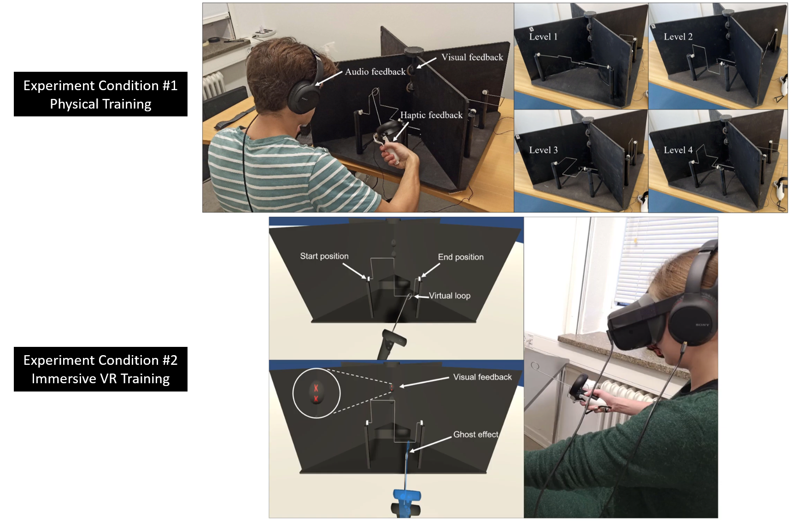

# Buzzwire Experiment Code 

This repository contains the Unity and Arduino project files developed for a VR experiment I developed as part of my PhD work at the [Extended Reality and Robotics lab](https://btech.au.dk/en/research/sections-centres-and-strategic-projects/engtech/labs/the-extended-reality-and-robotics-lab) at Aarhus University. The experiment aimed to investigate the effectiveness of immersive virtual reality (VR) in training participants in fine motor skills, specifically using the 'buzz-wire' task. The study compared VR training to physical training and explored the relationship between participants’ physiological arousal and their improvements in task performance.

## Table of Contents
- [Introduction](#introduction)
- [Requirements](#requirements)
- [Projects](#projects)
- [Cite Our Work](#cite-our-work)
- [Authors and Acknowledgment](#authors-and-acknowledgment)
- [Visual Overview](#visual-overview)
- [Video](#video)

## Introduction

In this study, we designed a fine motor skill training task and evaluated its effectiveness in two different conditions: immersive virtual reality (VR) and physical setup. Our objectives were twofold:
- To investigate how well immersive VR can train participants in the 'buzz-wire' task compared to traditional physical training.
- To explore the link between participants’ physiological arousal levels and their performance improvements.

We conducted a between-subjects experiment with 87 participants randomly assigned to either the VR or physical training condition. Physiological arousal was measured using electro-dermal activity (EDA) and electrocardiogram (ECG) data. Key findings from the study include:
- VR training was found to be as effective as, or slightly better than, physical training in improving fine motor skills.
- Participants in the VR condition reported higher self-efficacy and immersion.
- There were marginally significant differences in presence and temporal demand (NASA-TLX measurements) between the two conditions.
- On average, participants in the VR condition exhibited lower arousal levels compared to those in the physical condition.
- A closer examination of EDA values indicated that participants with lower arousal levels during training demonstrated better performance improvements, regardless of the training condition.

These findings highlight the potential of VR for effective skill training and suggest that integrating physiological data could enhance the design of adaptive VR training systems.

## Requirements

- **Unity 2019.4.25f1**
- **Arduino IDE**

## Projects

The projects are organized into the following sub-folders:

1. **BuzzWireArduinoCode**: Arduino code for the physical condition setup.
2. **BuzzWireTestArduinoCode**: Arduino code for the pre/post-test setups.
3. **BuzzwireUnityService**: Unity project for the physical condition managing haptic/audio feedback and sending event signals from the Arduino to iMotions.
4. **BuzzwireVR**: Unity project for the VR condition managing visual/haptic/audio feedback and sending event signals from the Arduino to iMotions.
5. **HardwareDesigns**: Files for 3D printing the Oculus handle and electronics layout diagrams (made with Fritzing).

## Cite Our Work

```bibtex
@article{radhakrishnan2023investigating,
  title={Investigating the effectiveness of immersive VR skill training and its link to physiological arousal},
  author={Radhakrishnan, Unnikrishnan and Chinello, Francesco and Koumaditis, Konstantinos},
  journal={Virtual Reality},
  volume={27},
  pages={1091--1115},
  year={2023},
  publisher={Springer},
  doi={10.1007/s10055-022-00699-3}
}
```

## Authors and Acknowledgment

- **Programming (Unity/Arduino)**: Unnikrishnan Radhakrishnan, PhD fellow, Aarhus University
- **Design of Experiment**: Unnikrishnan Radhakrishnan, Konstantinos Koumaditis, Francesco Chinello
- **Hardware**: Francesco Chinello, Unnikrishnan Radhakrishnan

## Visual Overview



*Depiction of both VR and physical conditions used in the buzzwire experiment.*


*Screen recording of the VR condition showing a participant engaging in the buzzwire task in virtual reality.*

## Video 

Please refer to the following [YouTube video](https://www.youtube.com/watch?v=DlZ1-_XerL0).

## Follow-Up Work

The follow-up work incorporated subjective measures of arousal along with the EDA and ECG measures, to investigate the effects of various haptic feedback on both task performance and arousal. For more information, please refer to the [paper](https://ieeexplore.ieee.org/abstract/document/10262332/) and the associated [GitHub project](https://github.com/karmakomik/BuzzwireHapticsExperiment).
